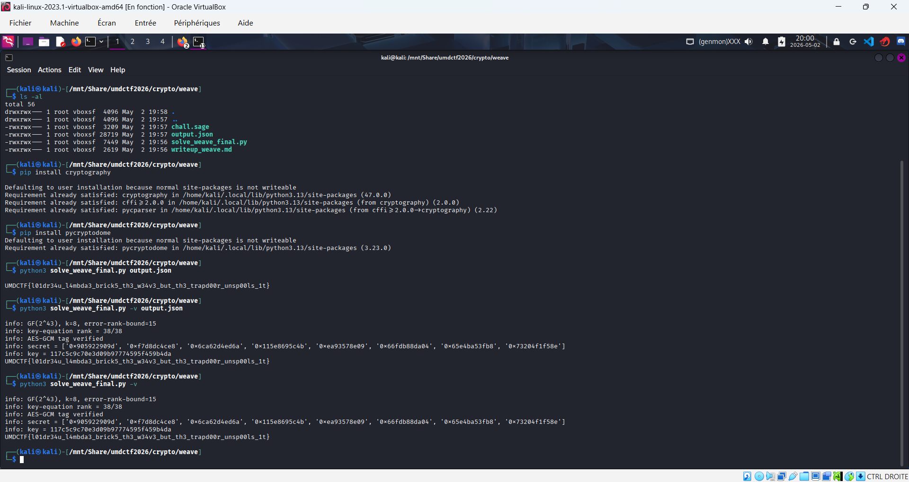
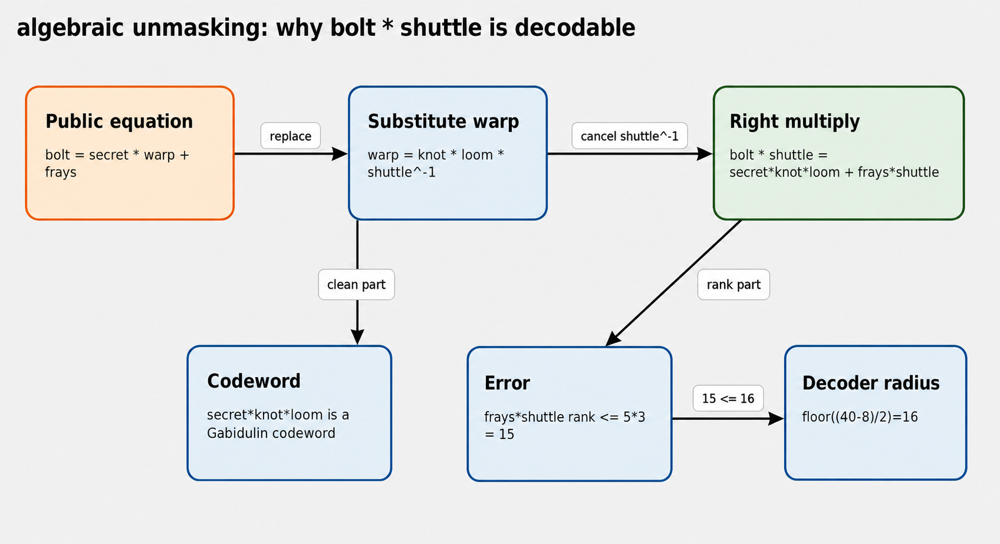
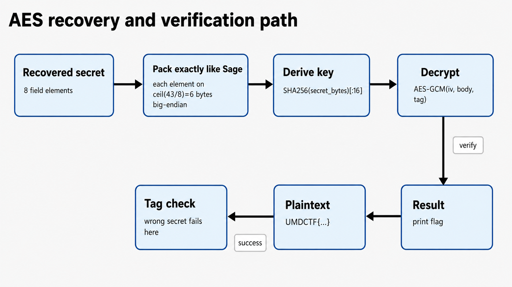
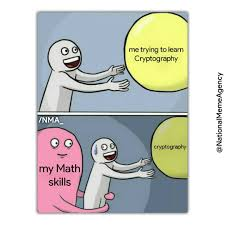
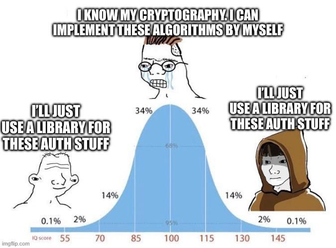

# UMDCTF crypto/weave — Trapdoor Gabidulin unweaving (basis merged v7)

**Basis document:** uploaded `writeup_weave.docx`  
**Main improvements in v7:** acronym/abbreviation primer before the technical sections, more precise newcomer-friendly explanations, state-transition **box drawings** directly in the Markdown body instead of embedded Mermaid code, and the corresponding PNG diagram figures kept alongside the text.  
**Author:** AnyMoR Entry JOL  
**Writeup/Figures license:** CC BY 4.0  
**Solver license:** MIT

## Challenge statement

```text
crypto/weave
ph1nx_
56 solves / 145 points

every piece of the cipher lies open on the table. compose them correctly and the flag is yours.
```

## Adapted objective

The uploaded DOCX already contained the main algebraic solve path. This v7 rewrite keeps that basis but makes the document more accessible and more operational:

1. it explains the **acronyms and abbreviations first**;
2. it adds a more explicit glossary before the specialized weaving vocabulary;
3. it replaces inline `.mmd` source in the Markdown body with **box-drawing state-transition diagrams**;
4. it keeps the corresponding **PNG diagram images** for visual support;
5. it expands the explanations so that a newcomer can follow not just **what** to do, but **why** each step is valid.

The practical goal is still the same:

- rebuild `GF(2^43)` from the public modulus;
- recognize that `loom` is a Gabidulin generator matrix;
- compute `received = bolt * shuttle`;
- prove that the transformed error has rank at most `5 * 3 = 15`;
- decode because the unique-decoding radius is `floor((40-8)/2) = 16`;
- remove `knot` to recover the real `secret`;
- derive the AES key and decrypt the vault.

Final flag:

```text
UMDCTF{l01dr34u_l4mbda3_brick5_th3_w34v3_but_th3_trapd00r_unsp00ls_1t}
```

---

## 1. Acronyms and abbreviations for newcomers

This section intentionally comes **before** the challenge-specific terminology.

| Acronym / abbreviation | Full form | Meaning here |
|---|---|---|
| AES | Advanced Encryption Standard | The block cipher used to protect the final flag. |
| GCM | Galois/Counter Mode | The authenticated-encryption mode wrapped around the flag. |
| AEAD | Authenticated Encryption with Associated Data | The security family to which AES-GCM belongs; it provides both confidentiality and integrity. |
| GF | Galois Field | A finite field. In this challenge, all main algebra happens in `GF(2^43)`. |
| JSON | JavaScript Object Notation | The format of `output.json`, which stores the public challenge instance. |
| PNG | Portable Network Graphics | The image format used for the exported explanatory diagrams. |
| DOCX | Microsoft Word document format | The format of the main editable writeup document. |
| Sage | SageMath | A mathematics system that can manipulate finite fields and matrices conveniently. |
| q-power / Frobenius power | repeated exponentiation by `q` | In this challenge, `q = 2`, so powers like `x^(2^j)` define the Gabidulin generator. |
| rank | vector-space dimension | Measures the effective dimension of the error over the base field. |
| unique-decoding radius | maximum guaranteed correctable error size | For this instance it is `16`. |

### Why this primer matters

A newcomer can easily get lost because the challenge mixes:

- cryptography terminology,
- coding-theory terminology,
- linear-algebra terminology,
- and custom weaving-themed variable names.

So before discussing `loom`, `knot`, or `shuttle`, we first clarify the universal abbreviations.

---

## 2. Basic terminology before the specialized vocabulary

Before the challenge-specific names, here are the plain-language concepts.

| Plain concept | Meaning |
|---|---|
| Finite field | A set where addition, subtraction, multiplication, and division (except by zero) are all defined and stay inside the set. |
| Matrix | A rectangular table of field elements. Here it is used to encode and decode messages. |
| Invertible matrix | A matrix that can be “undone” by multiplying with its inverse. Both `knot` and `shuttle` are invertible. |
| Codeword | The encoded form of a message. |
| Error vector | Extra noise added to hide the clean codeword. |
| Rank-metric code | A code where the size of the error is measured by rank rather than Hamming weight. |
| Gabidulin code | The rank-metric analogue of Reed-Solomon, built from Frobenius powers. |
| Masking | Multiplying by public invertible matrices so the code looks less obvious. |
| Decoding | Recovering the original message from a noisy encoded word. |

### Challenge vocabulary mapping

Now that the generic ideas are clear, the specialized names become easier to read.

| Weaving name | Technical meaning |
|---|---|
| `pegs` | Gabidulin support points |
| `loom` | Gabidulin generator matrix |
| `knot` | Public invertible left mask |
| `shuttle` | Public invertible right mask |
| `fibers` | A 3-dimensional public subspace restricting the shuttle coefficients |
| `frays` | Number of source error rows used to build the noise |
| `warp` | Public masked generator |
| `bolt` | Public noisy received word |
| `vault` | AES-GCM encrypted flag |

---

## 3. Mathematical formulation, slowly and precisely

The two main public equations are:

```text
warp = knot · loom · shuttle^-1
bolt = secret · warp + ε
```

Substituting the first equation into the second gives:

```text
bolt = secret · knot · loom · shuttle^-1 + ε
```

Because `shuttle` is public and invertible, we are allowed to multiply on the right by `shuttle`:

```text
bolt · shuttle = (secret · knot) · loom + ε · shuttle
```

We rename this new word:

```text
received = bolt · shuttle
```

So the decoder finally sees the standard form:

```text
received = message · loom + e
```

with:

- `message = secret · knot`
- `e = ε · shuttle`

### Why the error stays decodable

This point is the mathematical heart of the solve.

- `frays = 5` means the original error is built from 5 source rows.
- `fibers` has dimension 3, and the shuttle coefficients stay in that 3-dimensional span.
- Therefore the transformed error rank is bounded by:

```text
rank(e) <= 5 × 3 = 15
```

The unique-decoding radius for a Gabidulin code with `n = 40` and `k = 8` is:

```text
floor((n - k) / 2) = floor((40 - 8) / 2) = 16
```

So the instance is solvable because:

```text
15 <= 16
```

That single inequality is the formal reason the decoding step is justified.

---

## 4. Compiling, setup and solver launch options

Strictly speaking, there is **no compilation** step because the solver is Python. However, users often still want a table of “compiling options”, so the practical equivalent is: syntax-checking, dependency installation, environment setup, and execution modes.

| Option type | Purpose | Command | When to use it |
|---|---|---|---|
| Syntax check (pseudo-compilation) | Verify that the Python file parses correctly | `python3 -m py_compile solve_weave_final.py` | Before running the solver, especially after edits |
| Minimal dependency install | Install the AES dependency | `python3 -m pip install pycryptodome` | If `Crypto.Cipher.AES` is missing |
| Virtual environment setup | Create a clean local environment | `python3 -m venv .venv && . .venv/bin/activate && pip install pycryptodome` | Recommended for reproducibility |
| Direct solve | Run the solver normally | `python3 solve_weave_final.py output.json` | Preferred final solve command |
| Verbose solve | Run with detailed logs | `python3 solve_weave_final.py output.json -v` | Best for writeup screenshots and debugging |
| Docker Sage run | Run in a Sage-compatible container | `docker run --rm -it -v "$PWD:/work" -w /work sagemath/sagemath:latest sage -python solve_weave_final.py output.json -v` | When you want behavior close to the original challenge environment |
| Challenge inspection | Check the public parameters | `sed -n "1,220p" chall.sage && jq ".spec" output.json` | To verify `q`, `m`, `n`, `k`, and `frays` |
| Documentation rebuild | Recreate the writeup package | `python3 generate_weave_artifacts.py` | Only if you want to regenerate the package files |

### Short explanation of the table

The syntax-check line is the closest thing to a “compile” step in Python. The virtual environment line is useful if you do not want to pollute the global Python installation. The Docker Sage line is not mandatory for the final solve, but it is convenient when you want to compare your pure-Python behavior with SageMath’s native finite-field tools.

---

## 5. Data-processing flow as box drawing + PNG figure

```text
┌──────────────────────────────┐
│ Load public instance         │
│ output.json                  │
└──────────────┬───────────────┘
               │
               v
┌──────────────────────────────┐
│ Parse spec                   │
│ q, m, n, k, frays, modulus   │
└──────────────┬───────────────┘
               │
               v
┌──────────────────────────────┐
│ Build GF(2^43)               │
│ from the irreducible         │
│ polynomial                   │
└──────────────┬───────────────┘
               │
               v
┌──────────────────────────────┐
│ Lift pegs, knot, shuttle,    │
│ and bolt into the field      │
└──────────────┬───────────────┘
               │
               v
┌──────────────────────────────┐
│ Compute received             │
│ = bolt · shuttle             │
└──────────────┬───────────────┘
               │
               v
┌──────────────────────────────┐
│ Prove rank bound             │
│ rank(e) <= 5 × 3 = 15        │
└──────────────┬───────────────┘
               │
               v
┌──────────────────────────────┐
│ Decode with Gabidulin loom   │
│ recover secret · knot        │
└──────────────┬───────────────┘
               │
               v
┌──────────────────────────────┐
│ Remove knot                  │
│ secret = (secret·knot)       │
│          · knot^-1           │
└──────────────┬───────────────┘
               │
               v
┌──────────────────────────────┐
│ Pack secret bytes            │
│ Derive SHA256-based AES key  │
└──────────────┬───────────────┘
               │
               v
┌──────────────────────────────┐
│ AES-GCM decrypt vault        │
│ and print the flag           │
└──────────────────────────────┘
```

**Explanation.** This box drawing replaces the inline Mermaid source in the Markdown body. It keeps the same logic but is visible even in a plain-text renderer. The equivalent PNG figure is shown below.


---

## 6. Solver state transitions as boxes + PNG figure

```text
[START]
   |
   v
┌──────────────────────────────┐
│ Load public JSON instance    │
└──────────────┬───────────────┘
               │
               v
┌──────────────────────────────┐
│ Build finite field           │
└──────────────┬───────────────┘
               │
               v
┌──────────────────────────────┐
│ Compose public pieces        │
│ and cancel the right mask    │
└──────────────┬───────────────┘
               │
               v
┌──────────────────────────────┐
│ Prove that the instance      │
│ is within decoding radius    │
└──────────────┬───────────────┘
               │
               v
┌──────────────────────────────┐
│ Decode Gabidulin word        │
└──────────────┬───────────────┘
               │
               v
┌──────────────────────────────┐
│ Remove knot and recover      │
│ the real secret              │
└──────────────┬───────────────┘
               │
               v
┌──────────────────────────────┐
│ Derive AES key and verify    │
│ the vault by tag check       │
└──────────────┬───────────────┘
               │
               v
             [FLAG]
```

**Explanation.** This state-transition drawing highlights that the solver is deterministic. There is no brute-force search for the flag; the logic is a straight line from the public JSON instance to a validated plaintext.


---

## 7. Decoding proof as transition boxes + PNG figure

```text
┌──────────────────────────────┐
│ Start from                   │
│ received = bolt · shuttle    │
└──────────────┬───────────────┘
               │
               v
┌──────────────────────────────┐
│ Rewrite as                   │
│ (secret·knot)·loom + e       │
└──────────────┬───────────────┘
               │
               v
┌──────────────────────────────┐
│ Bound the transformed error  │
│ rank(e) <= 5 × 3 = 15        │
└──────────────┬───────────────┘
               │
               v
┌──────────────────────────────┐
│ Compute decoder radius       │
│ floor((40-8)/2) = 16         │
└──────────────┬───────────────┘
               │
               v
          ┌───────────────┐
          │ Is 15 <= 16 ? │
          └──────┬────────┘
                 │ yes
                 v
┌──────────────────────────────┐
│ Unique decoding is valid     │
│ recover secret · knot        │
└──────────────┬───────────────┘
               │
               v
┌──────────────────────────────┐
│ Multiply by knot^-1          │
│ to get the real secret       │
└──────────────────────────────┘
```

**Explanation.** This is the proof skeleton of the whole attack. The key inequality `15 <= 16` is not just a nice observation; it is the formal reason the decoder is guaranteed to succeed.


---

## 8. Figure inventory

| Figure | File | Title | Purpose |
|---|---|---|---|
| 1 | `images/weave_png_diagram_00_terminal_proof.png` | Terminal proof | Shows a successful solver run |
| 2 | `images/weave_png_diagram_01_challenge_states.png` | Challenge-side generation | Explains how the public instance is built |
| 3 | `images/weave_png_diagram_02_solver_states.png` | Data-processing / solver flow | Summarizes the full solve pipeline |
| 4 | `images/weave_png_diagram_03_algebra.png` | Algebraic unmasking | Shows why `bolt · shuttle` is the core step |
| 5 | `images/weave_png_diagram_04_decoder.png` | Decoder states | Shows the decoder workflow |
| 6 | `images/weave_png_diagram_05_trapdoor.png` | Rank-bound / trapdoor explanation | Shows why the error remains decodable |
| 7 | `images/weave_png_diagram_06_aes.png` | AES/key derivation | Shows how the recovered secret yields the flag |
| 8 | `images/weave_png_diagram_07_pitfalls.png` | Pitfalls map | Shows common mistakes |
| 9 | `images/meme_cross_platform.png` | Meme 1 | Use the specific public structure |
| 10 | `images/meme_math_skills.jpg` | Meme 2 | Math is the real bottleneck |
| 11 | `images/meme_auth_stuff.jpg` | Meme 3 | Use a library for AES-GCM |

---

## 9. Technical figures and explanations

### Figure 1 — Terminal proof



This figure serves as evidence that the solver runs correctly, reconstructs the field, performs the decoding, and outputs the right flag.

### Figure 2 — Challenge-side generation


This figure explains the public generation logic: `loom` is built from Frobenius powers, then masked into `warp`, then used to produce `bolt`.

### Figure 3 — Algebraic unmasking



This figure visualizes the critical algebraic rewrite from `bolt` to `received = bolt · shuttle`.

### Figure 4 — AES/key derivation pipeline



This figure reminds the reader that AES-GCM is not the weak point. The flag becomes reachable only because the secret is recovered first.

---

## 10. Meme analogy chapter

### Figure 9 — Cross-platform meme


**Meaning in this challenge.** We do not need a universal attack against every rank-metric scheme. The public instance already reveals the exact structure we need to exploit. The lesson is: use the concrete algebra that is actually in front of you.

### Figure 10 — Math skills vs cryptography meme



**Meaning in this challenge.** The difficulty is mostly mathematical, not syntactic. Recognizing the Gabidulin structure and reasoning about rank are much more important than writing a lot of code.

### Figure 11 — “Use a library for auth stuff” meme



**Meaning in this challenge.** The custom part is the rank-metric algebra; the AES-GCM part should be delegated to a vetted library. That is both safer and simpler.

---

## 11. Common mistakes, with detailed explanations

| Mistake | Why it fails | Better approach |
|---|---|---|
| Treating `output.json` values as plain integers | The whole construction lives in `GF(2^43)`, so integer arithmetic breaks the structure immediately | Rebuild the field first, then lift every value into it |
| Attacking AES-GCM directly | AES-GCM is only the wrapper; without the secret-derived key, this is the wrong layer to attack | Solve the algebraic problem first |
| Forgetting to multiply by `shuttle` | Then the received word stays masked and does not match the standard Gabidulin form | Compute `received = bolt · shuttle` |
| Ignoring the rank proof | The decoder step may look magical without the inequality proof | Explicitly show `rank(e) <= 15 <= 16` |
| Removing `knot` too early | The decoder returns `secret · knot`, not the final secret | Decode first, then multiply by `knot^-1` |
| Re-implementing AES-GCM manually | It adds risk for no benefit | Use a standard crypto library |

---

## 12. Synthesis and conclusion

The entire solve is a structured rewriting exercise:

1. identify the finite field;
2. recognize the Gabidulin code;
3. cancel the public right mask;
4. prove that the transformed error remains inside the decoding radius;
5. decode the masked message;
6. remove the left mask;
7. derive the AES key and decrypt the vault.

So the final message of the challenge is methodological: when all algebraic pieces are public, the winning move is not brute force but **correct composition of the published structure**.

Final flag:

```text
UMDCTF{l01dr34u_l4mbda3_brick5_th3_w34v3_but_th3_trapd00r_unsp00ls_1t}
```
